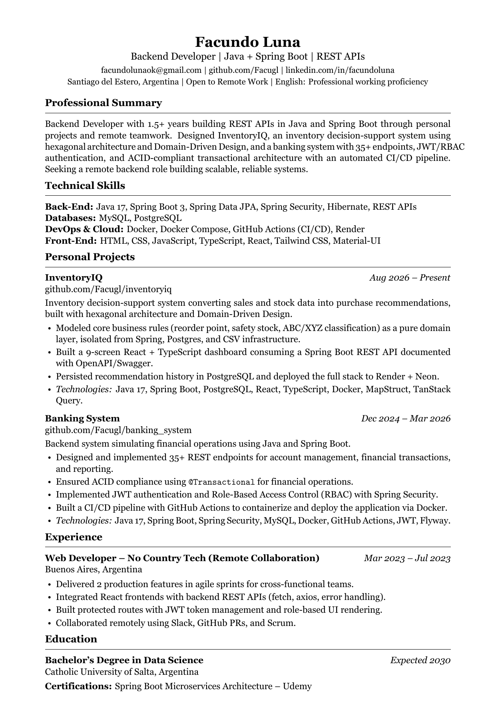

# CV

Fuente LaTeX de mi CV, en formato de una sola columna y compatible con ATS (Applicant Tracking Systems).

## Vista previa



## Archivos

- `Facundo-Luna-Backend-Developer.tex` — fuente LaTeX.
- `Facundo-Luna-Backend-Developer.pdf` — PDF compilado, listo para enviar.

## Compilar

Requiere [MiKTeX](https://miktex.org/) (o cualquier distribución TeX con `xelatex`, ya que se usa `fontspec` para la fuente Georgia).

```bash
xelatex -interaction=nonstopmode -jobname="Facundo-Luna-Backend-Developer" "Facundo-Luna-Backend-Developer.tex"
```

Los artefactos de compilación (`.aux`, `.log`, `.out`, etc.) están ignorados por git.
